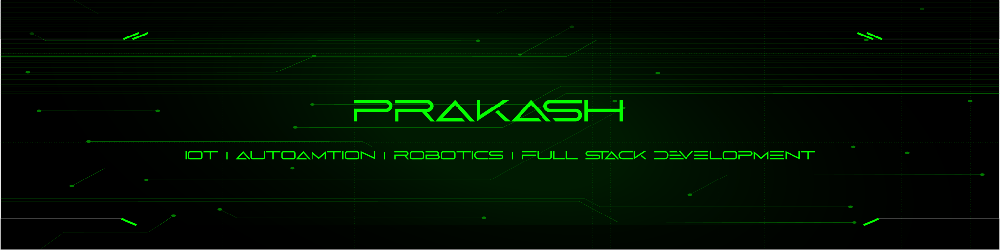

 

 
    <table align="center">
        <tr><td>⚜ <b>Name</b></td><td>Prakash</td></tr>
        <tr><td>💼 <b>Career</b></td><td>Project Management | Embedded Systems |  Full Stack</td></tr>
        <tr><td>👔 <b>Campus</b></td><td><a href="https://www.unibose.com">Unibose</a></td></tr>
        <tr><td>🎓 <b>Course</b></td><td><a href="https://blog-pink.netlify.app/">BE EEE</a></td></tr>
        <tr><td>🎒 <b>School</b></td><td><a href="https://krct.ac.in/about.php?cat=1&id=46">KRCT</a></td></tr>
        <tr><td>🌐 <b>Domain</b></td><td><a href="https://prakashravichandran.com">prakash.com</a></td></tr>
        <tr><td>💫 <b>Focus On</b></td><td>TANSIM REMS project</td></tr>
        <tr><td>🧰 <b>Toolkit</b></td><td> <a href="https://prakashravichandran.com/#skills"> Toolkit </a></td></tr>
        <tr><td>🍃 <b>Dairy</b></td><td> <a href="https://prakashdairies.netlify.app/"> Prakash Dairies</a></td></tr>
        <tr><td>📄 <b>Blog</b></td><td> <a href="https://blog-prakash.netlify.app/"> PrakasHub</a></td></tr>
        <tr><td>🧙 <b>Support</b></td><td>Open Source | Volunteering |  Peace | Loneliness</td></tr>
        <tr><td>💖 <b>Hobbies</b></td><td>Watching Movies | Listening to Music & Dancing </td></tr>
        <tr><td>⚡ <b>Fun fact</b></td><td>I'm setting sail for new heights on the high seas of life</td></tr>
        <tr><td>😍 <b>Love</b></td><td>To Make New Friends</td></tr>
    </table>
    
 

    
  

  
  
  
   
   

 

    

   

  

  

| Task | Count | Period |
|---|---|---|
|Drinking water|3 litres|per Day|
|Pushups|100|per Day|
|Blog Writing|min 2|per Week|
|Book Reading|5 pages|per Day|
|Don't Use Social Media|6 months|Until Birthday|

  

---

 <em><b>I love connecting with different people from around the world, so if you want to be my friend, feel free to <a href="https://www.instagram.com/prakashravichandrann/">reach out</a> </b> 😊 💖</em> 

