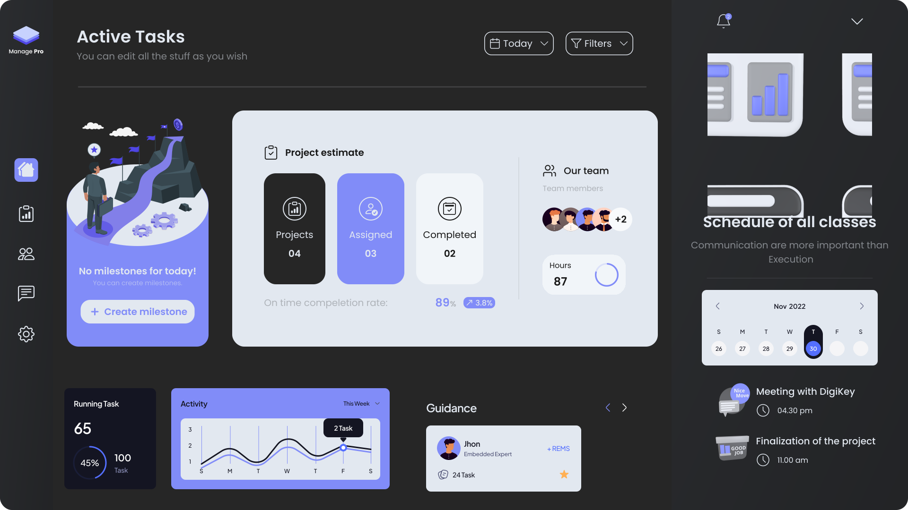

</a>
<!---->

 

 
    <table align="center">
        <tr><td>📛 <b>Name</b></td><td>Prakash</td></tr>
        <tr><td>👔 <b>Career</b></td><td>Project Management | Embedded Systems |  Full Stack</td></tr>
        <tr><td>📚 <b>Course</b></td><td><a href="https://blog-pink.netlify.app/">BE EEE</a></td></tr>
        <tr><td>🏫 <b>School</b></td><td><a href="https://krct.ac.in/about.php?cat=1&id=46">KRCT</a></td></tr>
        <tr><td>🌐 <b>Domain</b></td><td> <a href="https://prakashravichandran.com">prakash.com</a></td></tr>
        <tr><td>📜 <b>Blog</b></td><td> <a href="https://blog-prakash.netlify.app/"> PrakasHub</a></td></tr>
        <tr><td>☮️ <b>Support</b></td><td> Peace | Loneliness</td></tr>
        <tr><td>🏓 <b>Hobbies</b></td><td> Feel for her</td></tr>
        <tr><td>🥹 <b>Fun fact</b></td><td>Try to hide my sadness in the name of love</td></tr>
    </table>
    
 
<!--

-->    
  

  
  
  
   
   

  

 
<table>
  <tr>
    <td width="50%">
      
    </td>
    <td width="50%">
      <table>
        <tr>
          <th>Task</th>
          <th>Count</th>
          <th>Period</th>
        </tr>
        <tr>
          <td>Drinking Water</td>
          <td>3 litres</td>
          <td>per Day</td>
        </tr>
        <tr>
          <td>Pushups</td>
          <td>100</td>
          <td>per Day</td>
        </tr>
        <tr>
          <td>Meditation</td>
          <td>15 minutes</td>
          <td>per Day</td>
        </tr>
        <tr>
          <td>Blog Writing</td>
          <td>min 2</td>
          <td>per Week</td>
        </tr>
        <tr>
          <td>Book Reading</td>
          <td>5 pages</td>
          <td>per Day</td>
        </tr>
       <tr>
          <td>Hand Gripper</td>
          <td>200</td>
          <td>per Day</td>
        </tr>
      </table>
    </td>
  </tr>
</table>

  

<!--

  

-->

---

 

