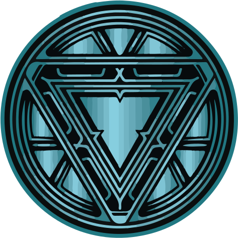
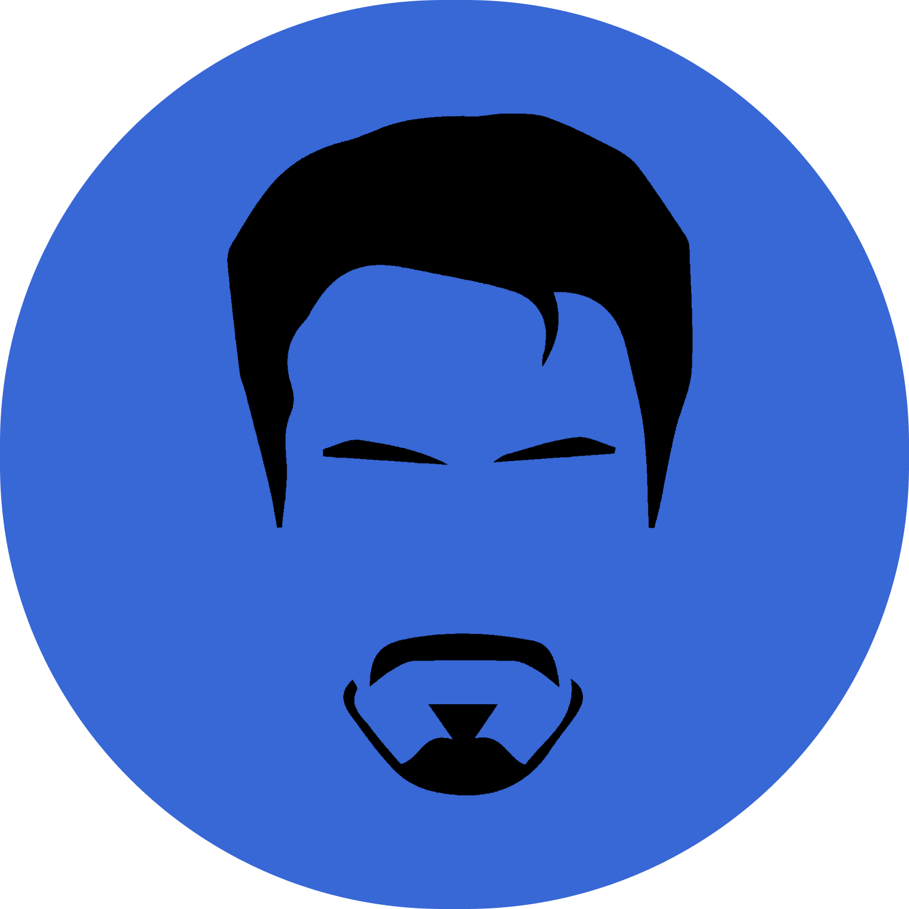

✨ &nbsp;Hello, Guardians! <br/> Uncover the wonders ♾️
======


<h3>✨ A Little Bit of Me</h3>

<a href="https://jarvisx.vercel.app/">
 </a>

```yaml
name: Prakash
best friend call me: MR. Stark
education:
  [
    "Self-Taught Developer and Designer",
    "Bachelor's in Electronics and Electrical",
  ]
fields_of_interests:
  [
    "Web Development",
    "Data Science",
    "Machine Learning",
    "UI/UX",
    "Embedded Systems",
    "IoT",
  ]
technical_background:
  [
    "Full Stack Developer"
    "Embedded Design Architect",
    "Electrical and Drives",
    "Electronics and Communication",
    "Control & Instrumentations",
    "From Design to Installation",
    "Data Science & Machine Learning in Python",
    "Internet Of Things",
    "Software Development",
  ]
  
currently_learning: ["🛠 DIY Raspberry Pi Projects, 🤖 Robotics, and 🖼️ Computer Vision"]
2024 Goals: ["Create 25+ Projects and learn at least 5-10 new Technologies."]
hobbies: ["Music 🎵", "Cinema 🎥", "Boxing 🥊", "Coding", "Writing ✍🏼"]
challenge: ["Stop using social media for 1 year"]
motto: ["Keep it simple and stupid ✨"]
fun fact: ["나는 아이언 맨이다 ✌🏼"]
```


<details>
<summary>💻 Tech Toolbox </summary>
<p align="center"></p>

<h4>Frontend</h4>
<p align="left">
    
  </a>
</p>

<h4>Backend</h4>
<p align="left">
    
  </a>
</p>

<h4>Embedded Systems</h4>
<p align="left">
    
  </a>
</p>

<h4>3D Modeling</h4>
<p align="left">
    
  </a>
</p>

<h4>Database</h4>
<p align="left">
    
  </a>
</p>

<h4>Cloud Servers</h4>
<p align="left">
    
  </a>
</p>

<h4>Tools</h4>
<p align="left">
    
  </a>
</p>
</details>


<details>
<summary>🏆 Noteworthy Milestones</summary>

<p align="center">
</p>
  
<div align="center">

 </div>

<div align="center">

 </div>
 </details>


<details>
<summary>📊 Insights from GitHub </summary>

<p align="center">
  
  
  


  
</p>

</details>


<details>
<summary>🐾 Stackoverflow State</summary>
<p  align="center">
  
</p>
</details>


<h3>🌈 Cultural Palette</h3>

<table border=1 border-radius: 10px;">
    <tr>
      <td colspan=3 align="center">
        <div>
          
       </div>
      </td>
    </tr>
    <tr>
      <td  align="center"padding-top:500;">
         <a href="https://prakashdairies.netlify.app/">  </a>
            <h6 align="center">Writing 📝</h6>
      </td>
      <td  align="center"padding-top:500;">
         <a href="https://literal.club/prakasravichandran/book/jayakanthan-sila-nerangalil-sila-manithargal-borgk">  </a>
         <h6 align="center">Book 📕</h6>
      </td>
      <td  align="center"padding-top:500;">
         <a href="https://movieecorn.netlify.app/movie/detail/425"></a>
       <h6 align="center">Movie 🍿</h6>
      </td>
    </tr>
  </table>


<!--<h3>🎯 Daily Target</h3>

<table>
        <tr>
          <th>Task</th>
          <th>Count</th>
          <th>Period</th>
        </tr>
        <tr>
          <td>Drinking Water</td>
          <td>3 litres</td>
          <td>per Day</td>
        </tr>
        <tr>
          <td>Pushups</td>
          <td>100</td>
          <td>per Day</td>
        </tr>
        <tr>
          <td>Meditation</td>
          <td>15 minutes</td>
          <td>per Day</td>
        </tr>
        <tr>
          <td>Blog Writing</td>
          <td>min 2</td>
          <td>per Week</td>
        </tr>
        <tr>
          <td>Book Reading</td>
          <td>5 pages</td>
          <td>per Day</td>
        </tr>
       <tr>
          <td>Hand Gripper</td>
          <td>200</td>
          <td>per Day</td>
        </tr>
</table>
<br>-->

<h3>🤝 Let's Collaborate</h3>
<p align="left">
<a href="https://linkedin.com/in/prakashravichandran10" target="blank"></a>&nbsp;&nbsp;
<a href="https://www.instagram.com/prakashravichandrann/" target="blank"></a>&nbsp;&nbsp;
<a href="https://twitter.com/Prakash_r10" target="blank"></a>&nbsp;&nbsp;
<a href="https://www.figma.com/@prakash_ui" target="blank"></a>&nbsp;&nbsp;
<a href="https://prakashdairies.netlify.app/" target="blank"></a>&nbsp;&nbsp;
<a href="https://prakashravichandran.com" target="blank"></a>&nbsp;&nbsp;
</p>
<br><br>

<p align="right">
<br> Created with 🧡 by <a href="https://prakashravichandran.com">Prakash</a><br><br><br>   </p>


<h3>MR.Stark Workspace 🔬</h3>


[](https://vimeo.com/video/931948800)

<br>


> ☠
