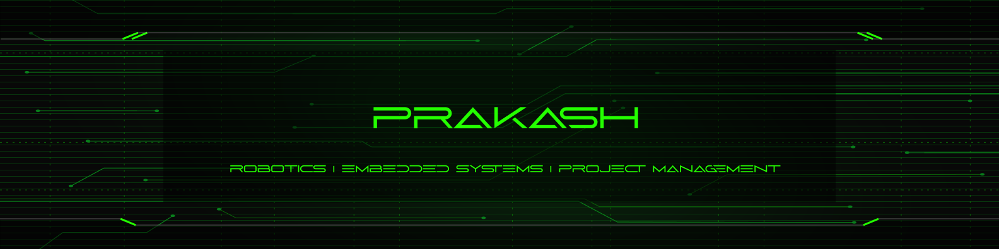

 

 
    <table align="center">
        <tr><td>⚜ <b>Name</b></td><td>Prakash</td></tr>
        <tr><td>💼 <b>Career</b></td><td>Project Management | Embedded Systems |  Full Stack</td></tr>
        <tr><td>🎓 <b>Course</b></td><td><a href="https://blog-pink.netlify.app/">BE EEE</a></td></tr>
        <tr><td>🎒 <b>School</b></td><td><a href="https://krct.ac.in/about.php?cat=1&id=46">KRCT</a></td></tr>
        <tr><td>🌐 <b>Domain</b></td><td><a href="https://prakashravichandran.com">prakash.com</a></td></tr>
        <tr><td>🧰 <b>Toolkit</b></td><td> <a href="https://prakashravichandran.com/#skills"> Toolkit </a></td></tr>
        <tr><td>📄 <b>Blog</b></td><td> <a href="https://blog-prakash.netlify.app/"> PrakasHub</a></td></tr>
        <tr><td>🧙 <b>Support</b></td><td>Open Source | Volunteering |  Peace | Loneliness</td></tr>
        <tr><td>💖 <b>Hobbies</b></td><td>Watching Movies | Listening to Music & Dancing </td></tr>
        <tr><td>⚡ <b>Fun fact</b></td><td>I'm setting sail for new heights on the high seas of life</td></tr>
        <tr><td>😍 <b>Love</b></td><td>To Make New Friends</td></tr>
    </table>
    
 
<!--

-->    
  

  
  
  
   
   

  

<!--<table align="center">
  <tr>
    <td align="center">
      
    </td>
  </tr>
  <tr>
    <td>
      <table>
        <tr>
          <td>
            
          </td>
          <td>
              
          </td>
        </tr>
      </table>
    </td>
  </tr>
</table>  

<table>
  <tr>
    <td width="50%">
      
    </td>
    <td width="50%">
      <table>
        <tr>
          <th>Task</th>
          <th>Count</th>
          <th>Period</th>
        </tr>
        <tr>
          <td>Drinking Water</td>
          <td>3 litres</td>
          <td>per Day</td>
        </tr>
        <tr>
          <td>Pushups</td>
          <td>100</td>
          <td>per Day</td>
        </tr>
        <tr>
          <td>Meditation</td>
          <td>15 minutes</td>
          <td>per Day</td>
        </tr>
        <tr>
          <td>Blog Writing</td>
          <td>min 2</td>
          <td>per Week</td>
        </tr>
        <tr>
          <td>Book Reading</td>
          <td>5 pages</td>
          <td>per Day</td>
        </tr>
        <tr>
          <td>Don't Use Social Media</td>
          <td>6 months</td>
          <td>Until Birthday</td>
        </tr>
      </table>
    </td>
  </tr>
</table>-->

---

 <em><b>I love connecting with different people from around the world, so if you want to be my friend, feel free to reach out</a> </b> 😊 💖</em> 

